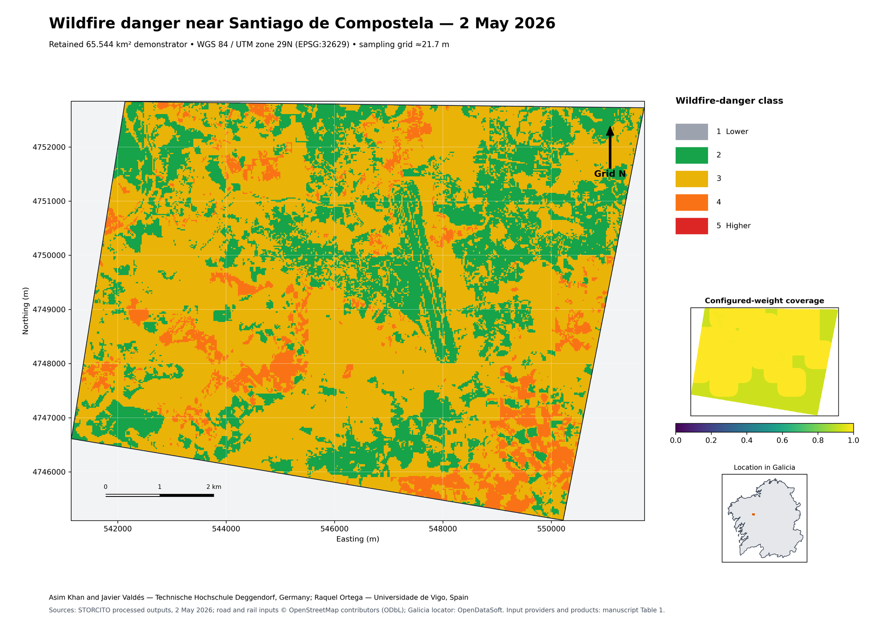
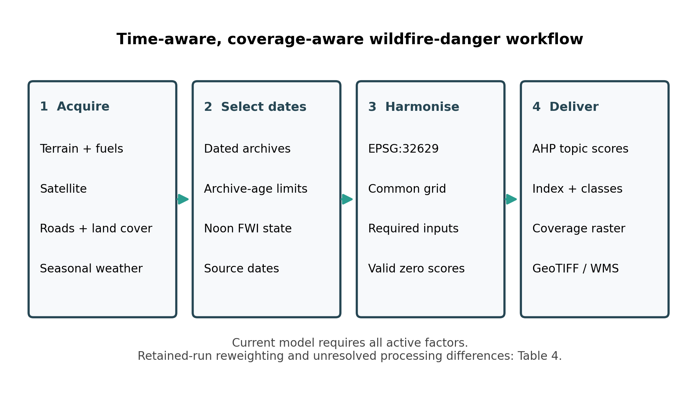
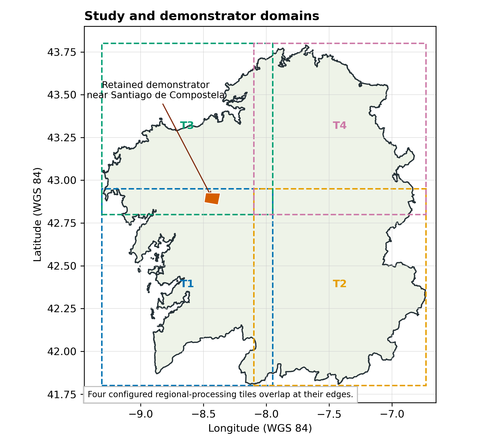
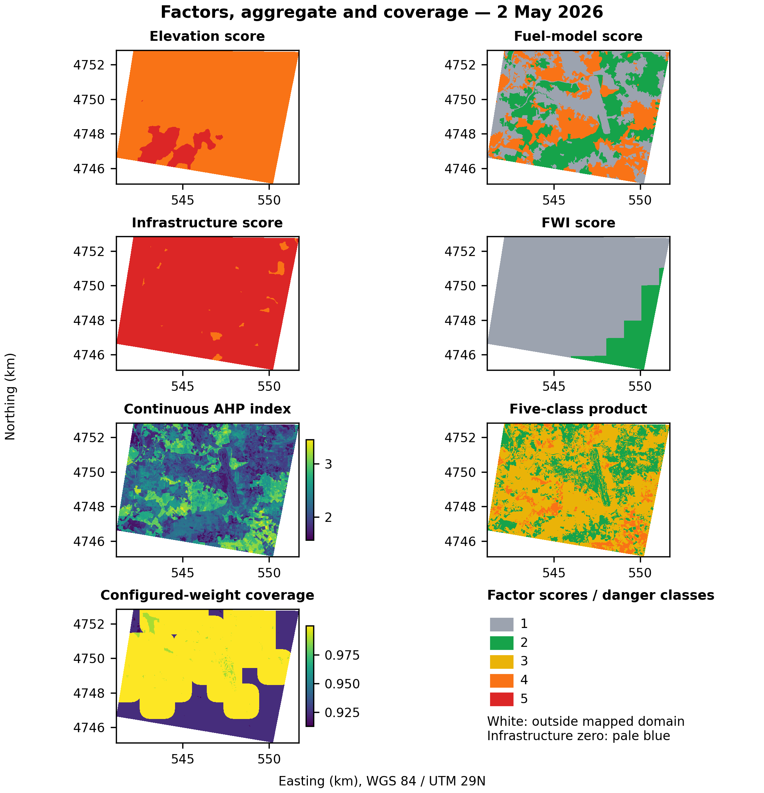
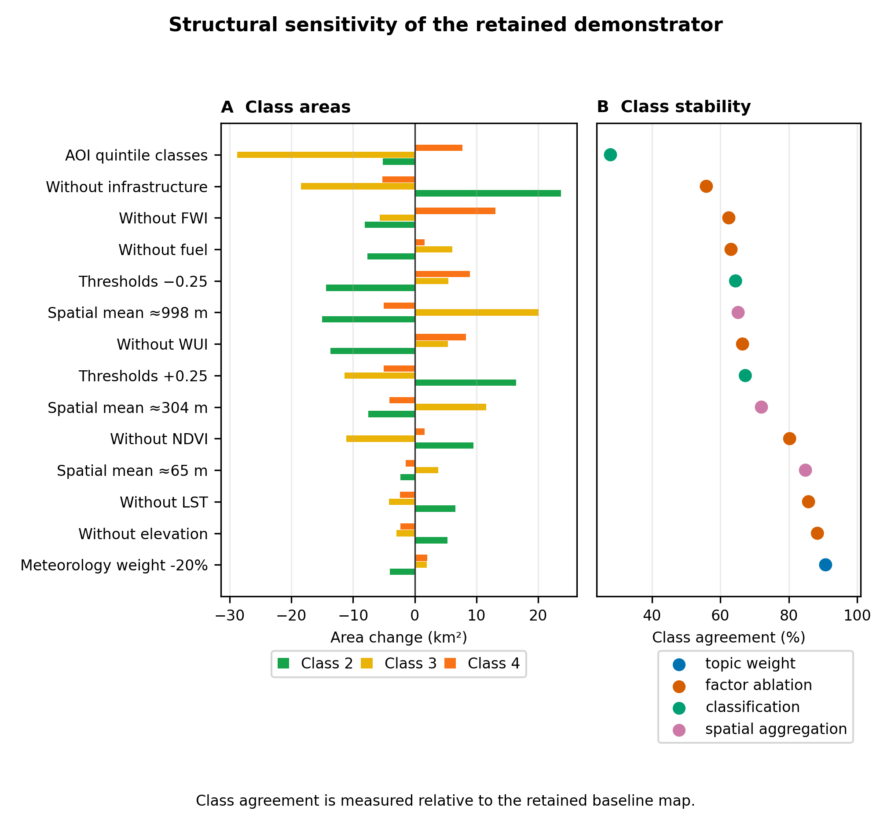

# Wildfire App
### Wildfire Risk Assessment & Simulation Platform

**Wildfire App** is a geospatial platform for assessing and simulating wildfire risk over user-defined regions. Users draw a polygon on an interactive map, configure a date range and resolution, and dispatch a simulation run. Results are published as GeoServer raster layers and surfaced as risk metrics, choropleth maps, and model comparisons in the browser.

The application is part of the **SpatialHub** ecosystem at TH Deggendorf, running at `wildfire-app.th-deg.de`.

---

## Overview

### Core Capabilities

- **Interactive Map** — Draw and edit region polygons (OpenLayers + MapLibre GL, 2D) with geocoding search and bookmarks
- **Model Configurator** — Step-by-step wizard to set region, date range, resolution, and optional layers before dispatching a simulation
- **Risk Metrics** — Weighted risk scoring (Very Low → Very High), affected area (km²), distribution histogram, and trend vs. prior run
- **Results Viewer** — Per-model results with GeoServer-backed choropleth map and ECharts visualisations
- **Model Comparison** — Side-by-side risk metrics and distribution charts across any two models
- **Workspaces & Groups** — Organise models into workspaces; share with Keycloak-managed groups
- **Real-time Notifications** — SSE push + Asynq background jobs for simulation status and system events
- **Admin Dashboard** — User, model, feedback, and webservice management with role-based access
- **Weather Settings** — Configure meteorological inputs for simulation runs
- **Feedback System** — In-app feedback with image attachments; auto-cleanup of closed items after 7 days

---

## Visualizations

Figures from the accompanying manuscript, *Coverage-aware wildfire-danger mapping in Galicia, Spain: workflow and structural sensitivity* (in preparation). The example outputs come from a saved run for a 65.5 km² area near Santiago de Compostela on 2 May 2026.

### Wildfire-danger map

<p align="center">
  
</p>

Danger classes 1–5 on a ≈21.7 m grid (WGS 84 / UTM zone 29N), with a panel showing configured-weight coverage (the share of model inputs available in each cell) and a Galicia locator. Only classes 2–4 occur in this output.

### Processing workflow

<p align="center">
  
</p>

Source acquisition, dated selection, harmonisation onto a common grid, scoring and Analytic Hierarchy Process (AHP) aggregation, and delivery through GeoServer to the web viewer.

### Study domain

<p align="center">
  
</p>

Galicia, the four overlapping processing tiles used for regional runs, and the example area.

### Input factors, danger index and coverage

<p align="center">
  
</p>

Four representative factor scores (elevation, fuel, infrastructure and FWI), the continuous danger index, the classified map and configured-weight coverage.

### Structural sensitivity

<p align="center">
  
</p>

How the map changes when single factors are removed, topic weights change by ±20%, class boundaries shift or cells are averaged spatially. Shown for the 14 scenarios with the lowest agreement with the baseline map.

> [!NOTE]
> The example run used an earlier version of the scoring rules than the current engine. The danger index is experimental and has not been validated against observed fires.

---

## Architecture

The full system architecture is documented on the project's MkDocs documentation site (see `docs/`). Run `mkdocs serve` to browse it locally.

### Data Flow

1. **Authentication**: Frontend → Nginx → Keycloak (OAuth2/OIDC) → Backend validates token → Redis session
2. **Model Creation**: User draws polygon + sets date range → Backend stores model draft
3. **Simulation Dispatch**: Backend → Platform Webservice queues model → Simulation engine runs → results ZIP POSTed back via callback
4. **Result Processing**: Asynq worker unpacks ZIP → publishes GeoServer layer → stores result in PostgreSQL
5. **Risk Metrics**: Backend samples GeoServer raster distribution (up to 2 000 pixels) → computes weighted score + trend vs. prior run
6. **Visualisation**: Frontend renders choropleth map (MapLibre), metric cards, and ECharts distribution chart

### Technology Stack

**Frontend**
- React 19 + TypeScript 5.8
- Vite 7 for build tooling
- TailwindCSS 4 + Radix UI components (`@spatialhub/ui`)
- TanStack Query 5 for server state
- Zustand 5 for client state
- OpenLayers 10 + MapLibre GL JS (2D mapping)
- ECharts 6 for risk distribution charts
- React Router 7 with lazy-loaded routes

**Backend**
- Go 1.24 + Gin web framework
- GORM with PostgreSQL driver
- Asynq (Redis-backed) for background jobs (`notifications` and `results` queues)
- Server-Sent Events (SSE) for real-time push
- Logrus structured logging
- Keycloak OIDC token validation + admin token provider

**Platform Core** (included in this repository)
- `platform-core/auth-service` — authentication microservice
- `platform-core/webservice` — simulation dispatcher and capacity manager
- `infrastructure/platform` — shared Go libraries (server, database, worker, email, security)
- `infrastructure/common` — shared domain models
- `libs/` — shared React component libraries (`@spatialhub/ui`, `auth`, `forms`, `i18n`)

**Infrastructure**
- PostgreSQL 17 + PostGIS for spatial and application data
- Keycloak 26 for OAuth2/OIDC identity management
- Redis 7 for sessions, caching, pub/sub, and task queue
- Nginx reverse proxy with SSL termination
- GeoServer for raster layer serving (WMS)
- Docker Compose orchestration

---

## Getting Started

Installation, local development, Makefile targets and environment variables are described in **[INSTALLATION.md](INSTALLATION.md)**. For a full local setup, run:

```bash
make setup
```

---

## Project Structure

```
.
├── wildfire-app/
│   ├── backend/          # Go API server (Gin, GORM, Asynq)
│   │   ├── cmd/          # Entrypoints: main, migrate, seed
│   │   └── internal/     # Handlers, services, stores, middleware
│   └── frontend/         # React SPA (Vite, TypeScript)
│       └── src/
│           ├── features/ # Feature modules (map, model-dashboard, comparison, …)
│           ├── components/
│           └── configuration/
├── platform-core/        # Platform services (auth-service, webservice, geoserver)
│   ├── auth-service/     # Authentication microservice
│   ├── webservice/       # Simulation dispatcher & capacity manager
│   └── geoserver/        # GeoServer stack
├── infrastructure/       # Shared Go libraries
│   ├── common/           # Shared domain models & contracts
│   └── platform/         # Server, database, worker, email, security
├── libs/                 # Shared React component libraries
│   ├── ui/               # @spatialhub/ui components
│   ├── auth/             # Auth library
│   ├── forms/            # Forms library
│   └── i18n/             # Internationalisation
├── nginx/                # Reverse proxy config (dev + prod)
├── Makefile              # Developer workflow commands
└── Dockerfile.ci         # Multi-stage build (frontend + backend)
```

---

## Contributing

Bug reports, feature requests and pull requests are welcome. Please read [CONTRIBUTING.md](CONTRIBUTING.md) and the [Code of Conduct](CODE_OF_CONDUCT.md) before getting started.

---

## Citation

If you use this software, please cite it using the metadata in [CITATION.cff](CITATION.cff).

---

## License

MIT License — Copyright (c) 2026 BigGeoData & Spatial AI, Technische Hochschule Deggendorf. See [LICENSE](LICENSE) for the full text.

> [!NOTE]
> This tool is under active development. The wildfire-danger index is experimental: it is not a calibrated ignition probability, and its outputs have not been validated against observed fires. Features and performance may change in future releases.

---

## Acknowledgments

Developed by the **BigGeoData & Spatial AI** research group at Technische Hochschule Deggendorf, in collaboration with Universidade de Vigo, which developed the STORCITO wildfire calculation engine.

This project is being developed in the context of the research project STORCITO — *Sustainable Transformation Of Rural Communities via Technical, social and Organizational innovations* (<https://cordis.europa.eu/project/id/101182153>). STORCITO is funded by the European Union's Horizon Europe research and innovation programme under grant agreement No. 101182153. Views and opinions expressed are however those of the author(s) only and do not necessarily reflect those of the European Union or the European Research Executive Agency (REA). Neither the European Union nor the granting authority can be held responsible for them.

<picture>
  <source media="(prefers-color-scheme: dark)" srcset=".github/assets/sponsors/storcito-logo-white.png">
  
</picture>
&nbsp;&nbsp;


Open data: Copernicus (Sentinel-2, Sentinel-3, CORINE Land Cover, CLC+ Backbone), MeteoGalicia, IGN/CNIG, MITECO, NASA FIRMS, OpenStreetMap and OpenDataSoft — see [ATTRIBUTIONS.md](ATTRIBUTIONS.md) for sources, licences and required attribution statements.
